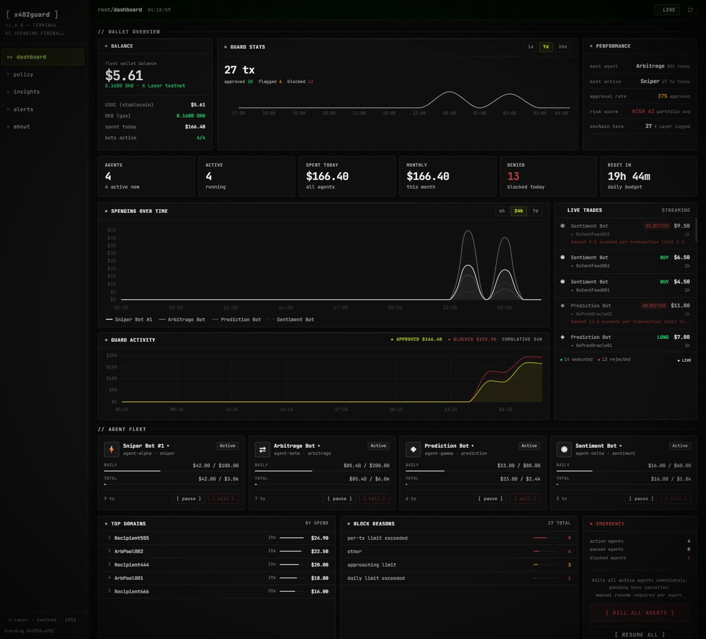

# x402 Guard — AI Bot Spending Firewall

> **Guard every AI agent payment before it hits the blockchain.**  
> Per-bot spending limits · Real-time dashboard · Onchain audit trail · Kill switch

[](https://www.okx.com/xlayer)
[](https://www.oklink.com/x-layer-testnet/address/0x295A3807ea95c69d835B44C6DaBA994C8580ef01)
[](https://www.moltbook.com/m/buildx)
[](LICENSE)

---

## What is x402 Guard?

x402 Guard is an **AI Bot Spending Firewall** — a middleware that sits between your AI agents and the blockchain. Every payment must pass through the guard before execution. No exceptions.

Built natively on **X Layer** with **OKX OnchainOS** integration, x402 Guard gives you:

- **Real-time visibility** into what every bot is spending
- **Automatic enforcement** of per-bot spending limits (daily / hourly / per-tx)
- **Immutable audit log** on X Layer via GuardLog.sol
- **One-click kill switch** to stop all agents instantly

### The Problem

AI trading bots (sniper, arbitrage, prediction, sentiment) control wallets autonomously. A single bug, bad signal, or exploit can **drain your wallet in seconds** with no warning and no way to stop it.

### The Solution

```
AI Bot → POST /guard/check → Policy Engine → APPROVED / SOFT_ALERT / BLOCKED
                                    ↓
                          GuardLog.sol on X Layer
                          (immutable, permanent record)
```

One API call before every payment = complete spending control across your entire bot fleet.

---

## Screenshots

> Dashboard showing 4 AI agents, real-time spending, and the 7-layer policy engine



> **Note:** Clone and run locally to see the live dashboard — see [Run Locally](#local-development) below.

---

## Features

| Feature | Description |
|---------|-------------|
| 🛡️ **Spending Limits** | Daily / Hourly / Per-transaction limits per bot |
| ⚡ **Kill Switch** | Stop all transactions instantly from dashboard |
| 📊 **Real-time Dashboard** | Watch every transaction as it happens |
| ⛓️ **On-chain Audit** | Every decision logged to GuardLog.sol on X Layer |
| 👛 **Wallet Tracking** | Real OKB + USDC balance per bot wallet |
| 🤖 **Multi-bot Support** | Sniper, Arbitrage, Prediction, Sentiment bots |
| 🔔 **Smart Alerts** | Soft alerts before limits, hard blocks at limit |

---

## Run Locally

🌐 **Dashboard:** http://localhost:3000 (after `npm run dev`)  
🔗 **API:** http://localhost:8000 (after `python main.py`)  
📋 **Contract:** `0x295A3807ea95c69d835B44C6DaBA994C8580ef01` (X Layer Testnet)

---

## Architecture

```
┌─────────────────────────────────────────────────────────┐
│                    Your AI Bot                          │
│    (sniper bot / arbitrage bot / prediction bot)        │
└────────────────────┬────────────────────────────────────┘
                     │ POST /guard/check
                     ▼
┌─────────────────────────────────────────────────────────┐
│              x402 Guard API (localhost:8000)             │
│                                                         │
│  ┌──────────────┐  ┌────────────┐  ┌────────────────┐  │
│  │ Policy Engine│  │ AI Copilot │  │ Onchain Logger │  │
│  │ (limits)     │  │ (anomaly)  │  │ (GuardLog.sol) │  │
│  └──────────────┘  └────────────┘  └────────────────┘  │
└────────────────────┬────────────────────────────────────┘
                     │ approve / block / soft_alert
                     ▼
┌─────────────────────────────────────────────────────────┐
│              X Layer Blockchain                         │
│         GuardLog.sol — immutable audit trail            │
└─────────────────────────────────────────────────────────┘
```

---

## Quick Integration

Add x402 Guard to your bot in **5 lines**:

```python
import requests

def check_before_pay(bot_id: str, amount: float, recipient: str) -> bool:
    r = requests.post("http://localhost:8000/guard/check", json={
        "agent_id":   bot_id,
        "amount":     amount,
        "pay_to":     recipient,
        "asset":      "0x4ae46a509f6b1d9056937ba4500cb143933d2dc8",
        "network":    "eip155:1952",
        "request_id": str(uuid.uuid4()),
    })
    return r.json()["action"] == "approve"

# In your bot:
if check_before_pay("my-sniper-bot", 12.5, "0xRecipient..."):
    # proceed with payment
    execute_transaction(...)
```

```typescript
// TypeScript / Node.js
const response = await fetch("http://localhost:8000/guard/check", {
  method: "POST",
  headers: { "Content-Type": "application/json" },
  body: JSON.stringify({
    agent_id:   "my-arb-bot",
    amount:     25.0,
    pay_to:     "0xRecipient",
    asset:      "0x4ae46a509f6b1d9056937ba4500cb143933d2dc8",
    network:    "eip155:1952",
    request_id: crypto.randomUUID(),
  }),
});
const { action, reason } = await response.json();
// action: "approve" | "soft_alert" | "block"
```

---

## API Reference

### `POST /guard/check`
Check if a payment is allowed.

**Request:**
```json
{
  "agent_id":   "my-bot",
  "amount":     10.5,
  "pay_to":     "0xRecipient",
  "asset":      "0x4ae46a...",
  "network":    "eip155:1952",
  "request_id": "unique-id"
}
```

**Response:**
```json
{
  "action":           "approve",
  "allowed":          true,
  "reason":           "Transaction approved within all policy limits.",
  "remaining_daily":  89.5,
  "remaining_hourly": 69.5,
  "transaction_id":   "uuid"
}
```

`action` values:
- `approve` — payment allowed
- `soft_alert` — allowed but approaching limit (> 80% used)
- `block` — payment denied

### `GET /guard/stats/{agent_id}`
Get spending stats for a bot.

### `GET /guard/transactions/{agent_id}`
Get transaction history for a bot.

### `POST /policies/`
Register a new bot with spending limits.

### `GET /wallet/balance/{address}`
Get real OKB + USDC balance from X Layer.

### `GET /onchain/stats`
Get on-chain stats from GuardLog.sol.

---

## Dashboard Guide

### Add Your Bot

1. Click **[ + add bot ]** in the top bar
2. Select bot type (Sniper / Arbitrage / Prediction / Sentiment / Custom)
3. Enter Bot Name, Bot ID, and wallet address (optional)
4. Set spending limits (Daily / Hourly / Per-tx)
5. Done — start sending `/guard/check` requests

### Connect Wallet

Wallet data is pulled from OKX OnchainOS — your agent wallets appear automatically once configured.

### Kill Switch

If a bot behaves unexpectedly:
- **Individual**: Click `[ kill ]` on the bot card
- **All bots**: Click `[ KILL ALL AGENTS ]` in the Emergency panel

---

## Bot Types & Recommended Limits

| Bot Type | Daily | Hourly | Per-tx | Use Case |
|----------|-------|--------|--------|----------|
| Sniper | $500 | $200 | $50 | Token launch sniping |
| Arbitrage | $1,000 | $400 | $100 | Cross-DEX arbitrage |
| Prediction | $200 | $80 | $20 | AI prediction trading |
| Sentiment | $100 | $40 | $10 | Social sentiment trading |
| Custom | Any | Any | Any | Define your own |

---

## Smart Alert System

```
0%─────────────80%────────────95%──────────100%
     Normal        Soft Alert     Paused     Blocked
```

- **< 80%** — transactions approved normally
- **80–95%** — `soft_alert` returned, bot warned (still allowed)
- **> 95%** — bot auto-paused
- **= 100%** — all transactions blocked until next reset

---

## On-Chain Logging

Every approved/blocked decision is logged to **GuardLog.sol** on X Layer testnet:

```solidity
function logDecision(
    string memory agentId,
    uint256 amount,       // amount * 1e6 (USDC precision)
    uint8 action,         // 0=approve, 1=soft_alert, 2=block
    string memory domain
) external
```

View the contract: [`0x295A3807...ef01`](https://www.oklink.com/x-layer-testnet/address/0x295A3807ea95c69d835B44C6DaBA994C8580ef01)

---

## Tech Stack

| Layer | Technology |
|-------|-----------|
| Smart Contract | Solidity — GuardLog.sol on X Layer |
| Backend | Python / FastAPI — self-hosted (port 8000) |
| Frontend | Next.js 14 / TypeScript — self-hosted (port 3000) |
| Database | JSON (volume-mounted, persistent) |
| Blockchain | X Layer Testnet (Chain ID: 1952) |
| Web3 | web3.py, ethers.js |

---

## Local Development

```bash
# Clone
git clone https://github.com/mintttch2/x402-guard
cd x402-guard

# Backend
cd backend
pip install -r requirements.txt
cp ../.env.example ../.env  # fill in values (OKX keys + GUARDIAN_PRIVATE_KEY)
python main.py               # runs on :8000

# Frontend
cd ../frontend
npm install
npm run dev                  # runs on :3000
```

**Required environment variables** (copy from `.env.example`):**
```env
# OKX OnchainOS API (get at https://www.okx.com/web3/build/dev-portal)
OKX_API_KEY=your_api_key
OKX_SECRET_KEY=your_secret_key
OKX_PASSPHRASE=your_passphrase
OKX_PROJECT_ID=your_project_id

# X Layer on-chain logging
GUARDIAN_PRIVATE_KEY=your_private_key
XLAYER_RPC_URL=https://testrpc.xlayer.tech
GUARDLOG_CONTRACT_ADDRESS=0x295A3807ea95c69d835B44C6DaBA994C8580ef01
```

### Running the Demo Bot

Simulate all 4 bots sending transactions through the guard:

```bash
# First, start the backend (terminal 1)
cd backend && python main.py

# Then run the demo (terminal 2)
python demo_bot.py
```

> Note: `demo_bot.py` creates a local file `agent_wallets.json` on first run
> to persist simulated wallet addresses across restarts. This file is auto-generated
> and is gitignored — no manual setup needed.

### Running Tests

```bash
pip install pytest
pytest backend/tests/ -v
# or via Makefile:
make test
```

---

## OKX Agentic Wallet Integration

x402 Guard works natively with **OKX Agentic Wallet** — x402 Guard controls the spending, OKX manages the keys.

### How It Works Together

```
OKX Agentic Wallet            x402 Guard
─────────────────────────────────────────────────────
Creates/holds private keys  → You control the limits
Signs transactions (TEE)    → We approve or block
Executes on X Layer         → We log every decision
Up to 50 sub-wallets        → One dashboard for all
Zero gas on X Layer         → Free onchain logging
```

### Option 1: MCP Server (for AI agents)

Add x402 Guard as an MCP tool to your Claude/Cursor/OpenClaw agent:

```json
// .mcp.json
{
  "mcpServers": {
    "x402guard": {
      "command": "python3",
      "args": ["mcp_server.py"],
      "env": { "X402_GUARD_URL": "http://localhost:8000" }
    }
  }
}
```

Then tell your agent:
```
Before every payment, call guard_check. If action is "block", do NOT pay.
```

The agent will automatically call `guard_check` before any x402 payment.

### Option 2: Register via MCP (auto-setup)

Your AI agent can register itself:

```
Agent: "Register my OKX Agentic Wallet 0x5672...E666 as a sniper bot with $500/day limit"
→ guard_register({ agent_id: "sniper-1", wallet_address: "0x5672...E666", bot_type: "sniper", daily_limit: 500, per_tx_limit: 50 })
→ Bot appears in x402 Guard dashboard immediately
```

### Option 3: Dashboard (manual)

1. Open [x402 Guard Dashboard](http://localhost:3000)
2. Click **[ + add bot ]**
3. Enter Bot ID and spending limits
4. Done — start sending `/guard/check` requests

### MCP Tools Available

| Tool | Description |
|------|-------------|
| `guard_check` | Check if payment is allowed (call before EVERY payment) |
| `guard_stats` | Get remaining budget and spending stats |
| `guard_register` | Register new OKX Agentic Wallet sub-wallet |
| `guard_kill` | Emergency kill switch for a bot |

### Example: Agent with Guard Protection

```python
# Your AI agent code
from mcp import MCPClient

guard = MCPClient("x402guard")

async def safe_pay(bot_id: str, amount: float, recipient: str):
    # 1. Ask x402 Guard
    result = await guard.call("guard_check", {
        "agent_id": bot_id,
        "amount":   amount,
        "pay_to":   recipient,
    })

    if result["action"] == "block":
        print(f"BLOCKED: {result['reason']}")
        return False

    if result["action"] == "soft_alert":
        print(f"WARNING: {result['reason']} — proceeding")

    # 2. OKX Agentic Wallet executes the payment
    await okx_wallet.pay(amount, recipient)
    return True
```

---

## Roadmap

- [x] WebSocket real-time updates
- [x] Telegram / Discord alert integration
- [ ] SDK: `npm install @x402guard/client`
- [ ] Multi-user support (API keys)
- [ ] Mainnet deployment (X Layer Chain ID: 196)
- [ ] Historical P&L charts

---

## Built for X Layer Hackathon

x402 Guard is built natively on **X Layer** — OKX's EVM-compatible Layer 2:

- ✅ Smart contract deployed on X Layer Testnet
- ✅ Real transactions verified on [OKLink Explorer](https://www.oklink.com/xlayer-test)
- ✅ OKB as native gas token
- ✅ USDC/USDG as payment asset
- ✅ OKX Wallet integration

---

## License

MIT — free to use, fork, and build upon.

---

*x402 Guard — Your AI bots, under control.*
